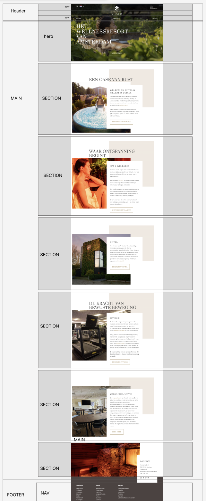

# Procesverslag
Markdown is een simpele manier om HTML te schrijven.  
Markdown cheat cheet: [Hulp bij het schrijven van Markdown](https://github.com/adam-p/markdown-here/wiki/Markdown-Cheatsheet).

Nb. De standaardstructuur en de spartaanse opmaak van de README.md zijn helemaal prima. Het gaat om de inhoud van je procesverslag. Besteedt de tijd voor pracht en praal aan je website.

Nb. Door *open* toe te voegen aan een *details* element kun je deze standaard open zetten. Fijn om dat steeds voor de relevante stuk(ken) te doen.

## Jij

  
uitwerken voor kick-off werkgroep

  ### Auteur:
 Cato Voors

  #### Je startniveau:
  Zwart

  #### Je focus:
 Responsive
 

## Je website

  
uitwerken voor kick-off werkgroep

  ### Je opdracht:
 https://zuiveramsterdam.nl 

  #### Screenshot(s) van de eerste pagina (small screen): 
  Home pagina
  

  #### Screenshot(s) van de tweede pagina (small screen):
  Ochtendentree 
  
 

## Toegankelijkheidstest 1/2 (week 1)

  
uitwerken na test in 2e werkgroep

  ### Bevindingen
  Lijst met je bevindingen die in de test naar voren kwamen:

## Breakdownschets (week 1)

  
uitwerken na afloop 3e werkgroep

  ### de hele pagina: 
  Breakdown schets home pagina
  

  Breakdown schets ochtendentree pagina

  ### dynamisch deel (bijv menu): 
  

  ### wellicht nog een dynamisch deel (bijv filter): 
  

## Voortgang 1 (week 2)

  
uitwerken voor 1e voortgang

Door persoonlijke omstandoigheden ben ik niet aanwezig geweest bij de voortgangsgesprekken. Ik heb dit besproken met mijn groepje en met de leraar. Ik heb vooral individueel gewerkt en heb wel hulp gevraargd wanneer ik dit nodig had. 

  ### Stand van zaken
  hier dit ging goed & dit was lastig (neem ook screenshots op van delen van je website en code)

  ### Agenda voor meeting
  samen met je groepje opstellen

  | student 1      | student 2          | student 3    | student 4        |
  | ---            | ---                | ---          | ---              |
  | dit bespreken  | en dit             | en ik dit    | en dan ik dat    |
  | en dat ook nog | dit als er tijd is | nog een punt | dit wil ik zeker |
  | ...            | ...                | ...          | ...              |

  ### Verslag van meeting
  hier na afloop snel de uitkomsten van de meeting vastleggen

  - punt 1
  - punt 2
  - nog een punt
  - ...

## Voortgang 2 (week 3)

  
uitwerken voor 2e voortgang

  Door persoonlijke omstandoigheden ben ik niet aanwezig geweest bij de voortgangsgesprekken. Ik heb dit besproken met mijn groepje en met de leraar. Ik heb vooral individueel gewerkt en heb wel hulp gevraargd wanneer ik dit nodig had.

  ### Stand van zaken
  hier dit ging goed & dit was lastig (neem ook screenshots op van delen van je website en code)

  ### Agenda voor meeting
  samen met je groepje opstellen

  | student 1      | student 2          | student 3    | student 4        |
  | ---            | ---                | ---          | ---              |
  | dit bespreken  | en dit             | en ik dit    | en dan ik dat    |
  | en dat ook nog | dit als er tijd is | nog een punt | dit wil ik zeker |
  | ...            | ...                | ...          | ...              |

  ### Verslag van meeting
  hier na afloop snel de uitkomsten van de meeting vastleggen

  - punt 1
  - punt 2
  - nog een punt
- ...

## Toegankelijkheidstest 2/2 (week 4)

  
uitwerken na test in 9e werkgroep

  ### Bevindingen
  Lijst met je bevindingen die in de test naar voren kwamen (geef ook aan wat er verbeterd is):

## Voortgang 3 (week 4)

  
uitwerken voor 3e voortgang

Door persoonlijke omstandoigheden ben ik niet aanwezig geweest bij de voortgangsgesprekken. Ik heb dit besproken met mijn groepje en met de leraar. Ik heb vooral individueel gewerkt en heb wel hulp gevraargd wanneer ik dit nodig had.

  ### Stand van zaken
  hier dit ging goed & dit was lastig (neem ook screenshots op van delen van je website en code)

  ### Agenda voor meeting
  samen met je groepje opstellen

  | student 1      | student 2          | student 3    | student 4        |
  | ---            | ---                | ---          | ---              |
  | dit bespreken  | en dit             | en ik dit    | en dan ik dat    |
  | en dat ook nog | dit als er tijd is | nog een punt | dit wil ik zeker |
  | ...            | ...                | ...          | ...              |

  ### Verslag van meeting
  hier na afloop snel de uitkomsten van de meeting vastleggen

  - punt 1
  - punt 2
  - nog een punt
  - ...

## Eindgesprek (week 5)

  
uitwerken voor eindgesprek

  ### Je uitkomst - karakteristiek screenshots:
 Home pagina
  

  Ochtend entree

  

  ### Dit ging goed/Heb ik geleerd: 
  Korte omschrijving met plaatjes

  

  ### Dit was lastig/Is niet gelukt:
  Korte omschrijving met plaatjes

  

## Bronnenlijst

  
continu bijhouden terwijl je werkt

  Nb. Wees specifiek ('css-tricks' als bron is bijv. niet specifiek genoeg). 
  Nb. ChatGpT en andere AI horen er ook bij.
  Nb. Vermeld de bronnen ook in je code.

  1. https://www.w3schools.com/html/html_comments.asp
  2. https://www.w3schools.com/css/css_comments.asp
  3. https://www.w3schools.com/accessibility/accessibility_labels.php
  4. https://www.w3schools.com/css/css3_mediaqueries.asp 
  5. https://www.w3schools.com/css/css_z-index.asp
  6. https://www.w3schools.com/howto/howto_css_hero_image.asp=
  7. https://chatgpt.com

Ik heb veel gebruik gemaakt van W3schools. Voor uitleg voorbeelden en begrippen. Ik heb chat gpt gebruikt voor uitleg als ik vast liep of uitleg nodig had. Ik heb ook klasgenoten gevraagd voor uitleg en hulp. Ik heb veel code ook overgenomen van oude websites die ik heb geschreven in vorige jaren als een soort opzet. Ook heb ik veel gebruik gemaakt van kennis die ik heb opgedaan van de oefeningen.